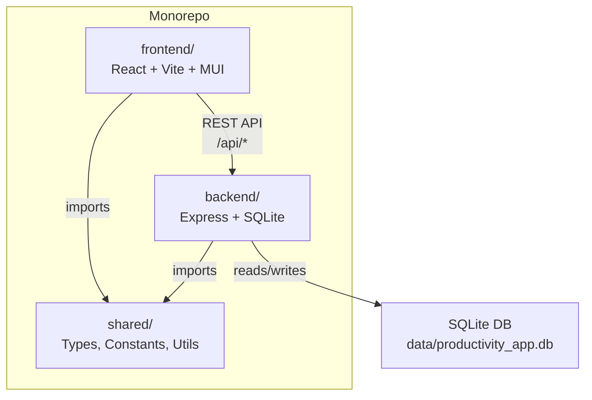

# Productivity App

A personal productivity suite combining todo management, diary journaling, bullet journaling, blog authoring, Eisenhower Matrix prioritization, and analytics -- built with React, Express, and SQLite.

## Features

- **Todo Management** -- create, filter, search, categorize, tag, and prioritize tasks with pagination
- **Eisenhower Matrix** -- 2x2 urgency/importance grid with auto-quadrant assignment via sliders
- **Diary** -- daily entries with mood, weather, energy level, gratitude, highlights, challenges, and tomorrow focus
- **Bullet Journal** -- daily, weekly, monthly, yearly, and future logs with rapid-logging symbols and keyboard shortcuts
- **Blog** -- markdown editor with drafts, publishing, SEO fields, reading time, and word count
- **Analytics Dashboard** -- task trends, matrix stats, writing analytics, and diary analytics powered by Recharts
- **Auth** -- register and login with bcrypt password hashing and bearer-token authentication
- **Dark Mode** -- light/dark theme toggle via MUI theming
- **Responsive** -- swipeable drawer on mobile, context-aware floating action button

## Tech Stack

- **Monorepo**: npm workspaces (`shared`, `backend`, `frontend`)
- **Frontend**: React 18, Vite 7, MUI 6, React Router 7, Recharts, Framer Motion, `@uiw/react-md-editor`
- **Backend**: Express 4, SQLite3, bcryptjs, express-validator, helmet, compression, rate-limiting
- **Shared**: TypeScript types, constants, and utility classes (DateUtils, EisenhowerUtils, TextUtils, ValidationUtils)
- **Language**: TypeScript 5.9 throughout
- **Testing**: Vitest (unit), Playwright (E2E)
- **Code Quality**: ESLint 9 (flat config), Prettier, Husky + lint-staged
- **CI/CD**: GitHub Actions (lint, format, build, unit tests, E2E tests)
- **Containerization**: Docker with multi-stage builds + docker-compose

## Architecture



## Project Structure

```
productivity-app/
├── shared/                     # Shared workspace package
│   └── src/
│       ├── types/              # TypeScript interfaces and type aliases
│       ├── constants/          # App-wide constants and config maps
│       └── utils/              # DateUtils, EisenhowerUtils, TextUtils, ValidationUtils
├── backend/                    # Express API server
│   └── src/
│       ├── config/             # Database setup (SQLite)
│       ├── controllers/        # Route handlers (auth, todos, diary, blog, bullet, analytics, ...)
│       ├── middleware/         # Auth guard, request validation
│       └── routes/             # Express routers (auth, todos, categories, tags, diary, bullet, blog, analytics)
├── frontend/                   # React SPA
│   └── src/
│       ├── components/         # Feature views (Todo, Matrix, Diary, BulletJournal, Blog, Analytics, ...)
│       ├── contexts/           # AuthContext, ThemeContext
│       ├── hooks/              # Data-fetching hooks (useTodos, useDiary, useBlog, useBulletJournal, useAnalytics)
│       ├── services/           # API client
│       └── theme/              # MUI theme configuration
├── data/                       # SQLite database (auto-created)
├── .github/workflows/ci.yml   # GitHub Actions CI pipeline
├── eslint.config.mjs           # ESLint 9 flat config (TypeScript + React)
├── vitest.config.ts            # Vitest root config with coverage
├── .prettierrc                 # Prettier formatting rules
├── .husky/                     # Pre-commit hooks (lint-staged)
├── Dockerfile                  # Multi-stage production build
├── docker-compose.yml          # Dev, prod, and SQLite-web services
├── .env.example                # Environment variable template
├── tsconfig.json               # Root TypeScript config
└── package.json                # Workspace root with npm scripts
```

## Getting Started

### Prerequisites

- Node.js >= 20
- npm

### Installation

```bash
npm install
```

### Environment Setup

```bash
cp .env.example .env
# Edit .env if needed -- defaults work for local dev
```

### Development

```bash
npm run dev
```

This starts all three workspaces concurrently:

- Frontend: `http://localhost:3000`
- Backend API: `http://localhost:3001`
- Dev login shortcut: username `dev`, password `dev`

### Production Build

```bash
npm run build
npm run start
```

## Docker

| Command                  | Description                            |
| ------------------------ | -------------------------------------- |
| `npm run docker:build`   | Build the Docker image                 |
| `npm run docker:up`      | Start production container (port 8080) |
| `npm run docker:up:all`  | Start app + SQLite web UI              |
| `npm run docker:down`    | Stop containers                        |
| `npm run docker:rebuild` | Rebuild and start                      |

The production container serves the built frontend as static files from the Express server on port 8080.

## API Overview

| Route Group    | Base Path         | Key Endpoints                             |
| -------------- | ----------------- | ----------------------------------------- |
| Health         | `/health`         | `GET /health`                             |
| Auth           | `/api/auth`       | register, login, logout, verify, profile  |
| Todos          | `/api/todos`      | CRUD with filters, pagination, search     |
| Categories     | `/api/categories` | CRUD                                      |
| Tags           | `/api/tags`       | CRUD + tag-todo links                     |
| Diary          | `/api/diary`      | list, get/upsert/delete by date           |
| Bullet Journal | `/api/bullet`     | logs, events, todo symbol updates         |
| Blog           | `/api/blog`       | CRUD + publish                            |
| Analytics      | `/api/analytics`  | dashboard, matrix, trends, writing, diary |

All endpoints under `/api/*` (except auth) require a bearer token in the `Authorization` header.

## Environment Variables

| Variable                  | Default                       | Description                                                 |
| ------------------------- | ----------------------------- | ----------------------------------------------------------- |
| `PORT`                    | `3001`                        | Backend server port                                         |
| `NODE_ENV`                | `development`                 | Environment mode                                            |
| `FRONTEND_URL`            | `http://localhost:3000`       | Allowed CORS origin                                         |
| `DATABASE_PATH`           | `../data/productivity_app.db` | SQLite database file path                                   |
| `JWT_SECRET`              | --                            | Secret key for signing auth tokens (required in production) |
| `LOG_LEVEL`               | `info`                        | Logging verbosity                                           |
| `RATE_LIMIT_WINDOW_MS`    | `900000`                      | Rate limit window in milliseconds (production only)         |
| `RATE_LIMIT_MAX_REQUESTS` | `100`                         | Max requests per rate limit window (production only)        |
| `VITE_API_URL`            | `http://localhost:3001`       | API base URL used by the frontend                           |

## Available Scripts

| Script                   | Description                                        |
| ------------------------ | -------------------------------------------------- |
| `npm run dev`            | Start all workspaces in development mode           |
| `npm run build`          | Build shared, backend, and frontend for production |
| `npm run start`          | Start the production backend server                |
| `npm run clean`          | Remove all `node_modules` and `dist` directories   |
| `npm run lint`           | Run ESLint across all workspaces                   |
| `npm run lint:fix`       | Run ESLint with auto-fix                           |
| `npm run format`         | Format all files with Prettier                     |
| `npm run format:check`   | Check formatting without writing                   |
| `npm run test:unit`      | Run Vitest unit tests                              |
| `npm test`               | Run tests across all workspaces                    |
| `npm run docker:build`   | Build the Docker image                             |
| `npm run docker:up`      | Start production container                         |
| `npm run docker:up:all`  | Start app + SQLite web UI                          |
| `npm run docker:down`    | Stop all containers                                |
| `npm run docker:rebuild` | Rebuild and start containers                       |

## Testing

### Unit Tests (Vitest)

Run unit tests with coverage:

```bash
npm run test:unit -- --coverage
```

Unit tests cover shared utilities (DateUtils, EisenhowerUtils, TextUtils, ValidationUtils) and backend error handling (AppError). Tests live alongside their source files with a `.test.ts` extension.

### E2E Tests (Playwright)

E2E tests require both backend and frontend to be running:

```bash
npm run dev                     # Start dev servers
cd frontend && npx playwright test          # Run all E2E specs
cd frontend && npx playwright test --headed # Run with visible browser
cd frontend && npx playwright show-report   # View HTML report
```

E2E specs cover auth, todos, diary, blog, matrix, analytics, and bullet journal. Each spec uses a unique test user to avoid data conflicts.

### CI Pipeline

GitHub Actions runs automatically on push/PR to `main`/`master`:

1. **Quality** -- lint, format check, build
2. **Unit Tests** -- Vitest (parallelized after quality)
3. **E2E Tests** -- Playwright with server startup (parallelized after quality)

## Code Quality

- **ESLint 9** -- flat config with TypeScript, React hooks, and Prettier integration
- **Prettier** -- consistent formatting (single quotes, trailing commas, 100 char width)
- **Husky + lint-staged** -- pre-commit hooks run ESLint fix and Prettier on staged files
- **AppError** -- standardized backend error handling with typed error classes and `next(err)` delegation

## License

MIT
